# Travel Agency — Spring Boot Project

A full-featured travel booking platform with secure authentication, payment processing, and role-based administration.

The class diagram of the Domain model is shown in the figure below:

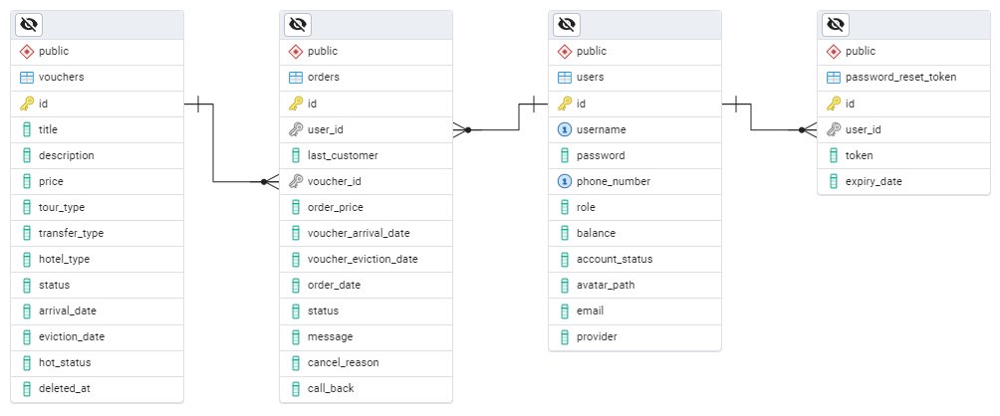

## ✨ Key Features

### 🔐 Advanced Authentication

- **OAuth2 Login** via Google and GitHub
- JWT token-based authentication
- Password recovery system (Forgot Password flow)
- Role-based access control:
    - `USER`: Browse and book tours
    - `MANAGER`: Mark tours as "hot", update booking statuses, order management
    - `ADMIN`: Full CRUD operations, user management
- Fully secured with **HTTPS** (TLS 1.3)

### 💳 Payment Integration

- Secure payment processing for bookings
- Order status tracking:
    - `REGISTERED` → `APPROVED` → `PAID`
    - `CANCELED` status flow

### 🌍 Multilingual Support

- Full internationalization (i18n):
    - English (default)
    - Ukrainian
- Dynamic language switching

### 🏝️ Tour Management

- Advanced filtering:
- "Hot deals" promoted by managers
- Detailed tour view with:
- Descriptions
- Hotel ratings
- Transfer types
- Date ranges

## 🛠️ Technology Stack

| Layer                | Technologies                                                    |
|----------------------|-----------------------------------------------------------------|
| **Core Backend**     | Spring Boot 3, Spring MVC, Spring Data JPA, Hibernate           |
| **Security**         | JWT Authentication, OAuth2 (Google/GitHub), Password Reset Flow |
| **Database**         | PostgreSQL with Soft Delete implementation                      |
| **Frontend**         | Thymeleaf, Bootstrap 5, jQuery (AJAX for dynamic content)       |
| **Architecture**     | DTO Pattern (with MapStruct), Layered Architecture              |
| **Payment**          | Stripe API integration for secure payments                      |
| **Order Management** | Full order lifecycle (REGISTERED → PAID → APPROVED/CANCELED)    |
| **DevOps**           | Maven, Embedded Tomcat                                          |
| **Quality**          | Global Exception Handler, AOP Logging, Input Validation         |

## 📸 Screenshots Gallery

  
  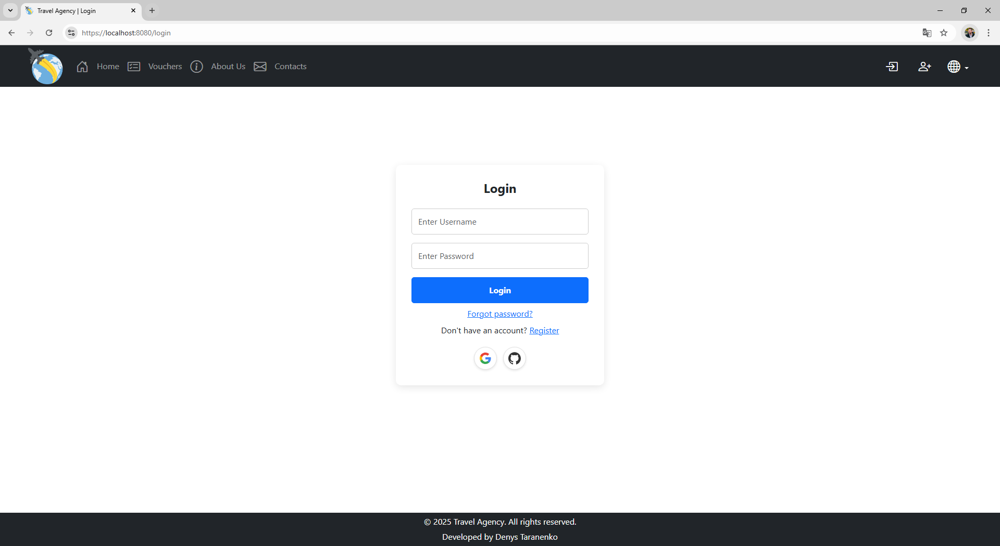
  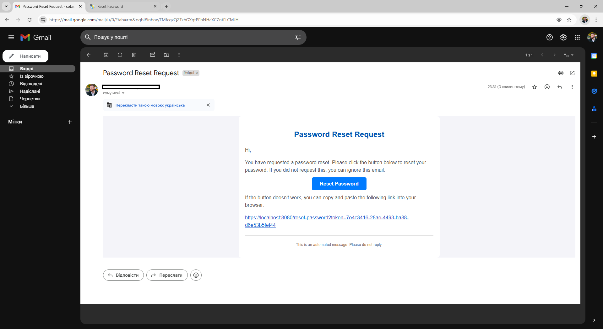
  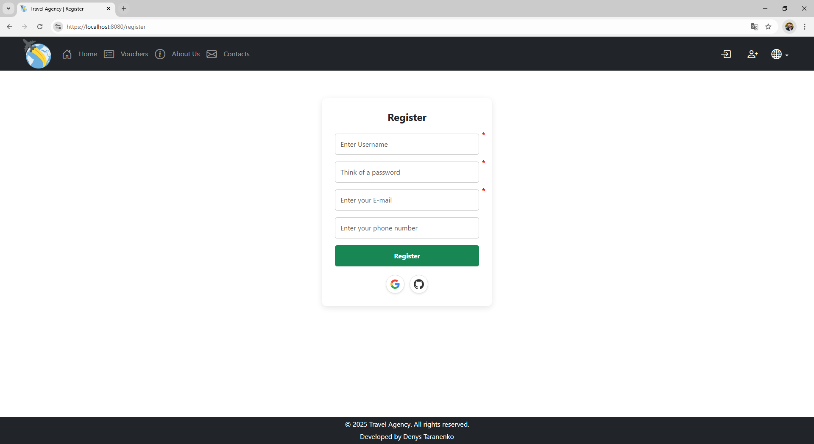
  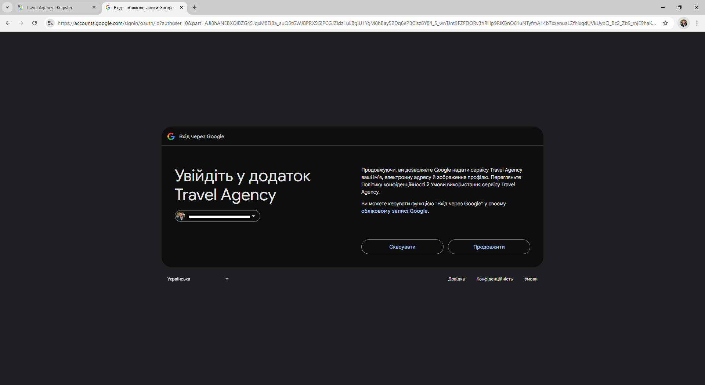
  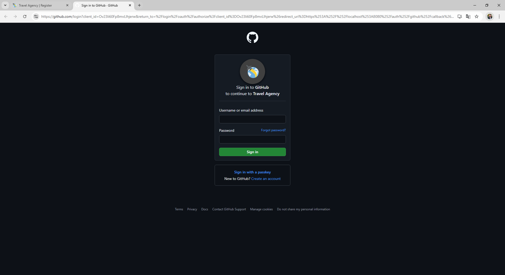

🔍 Show more screenshots

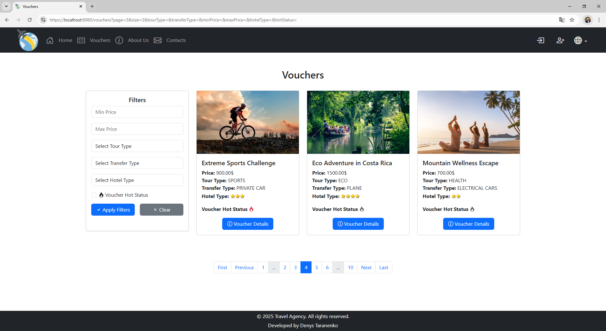 
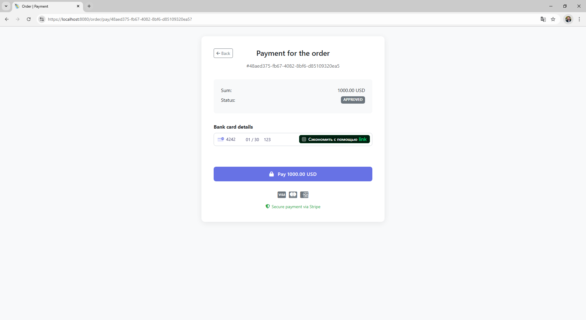 
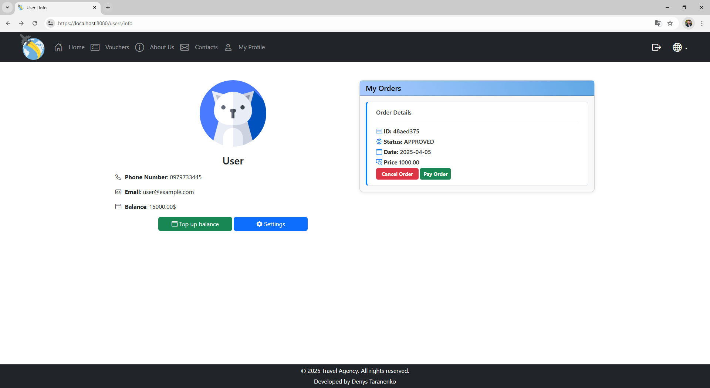 
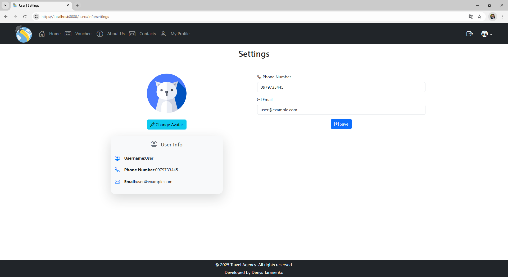 
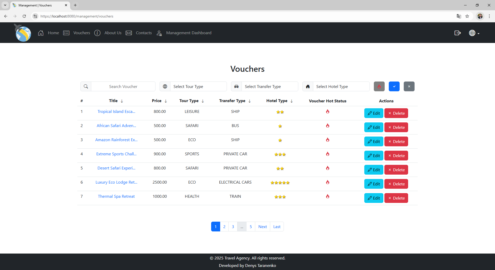 
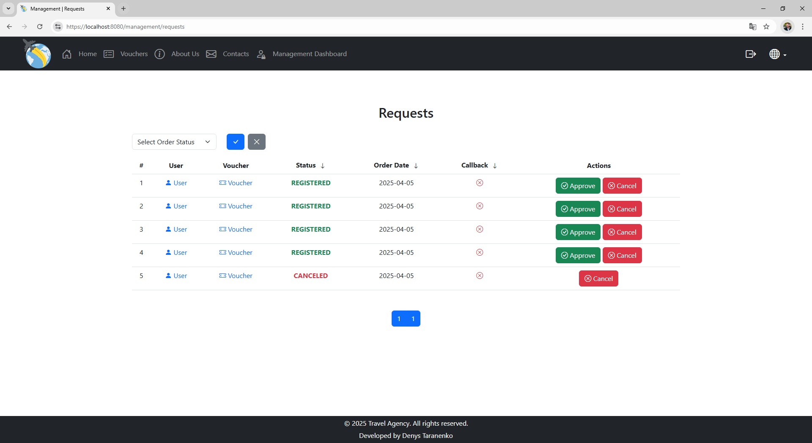 
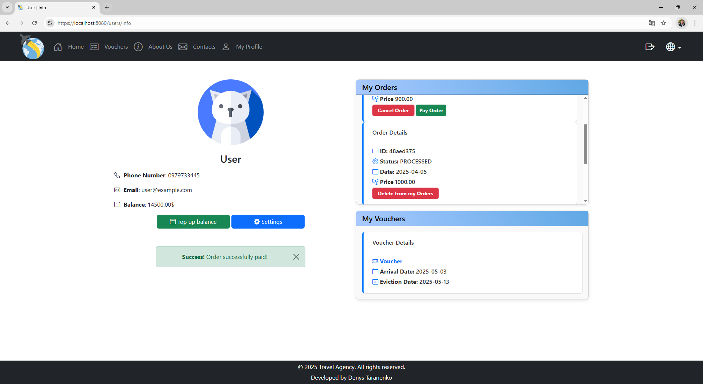
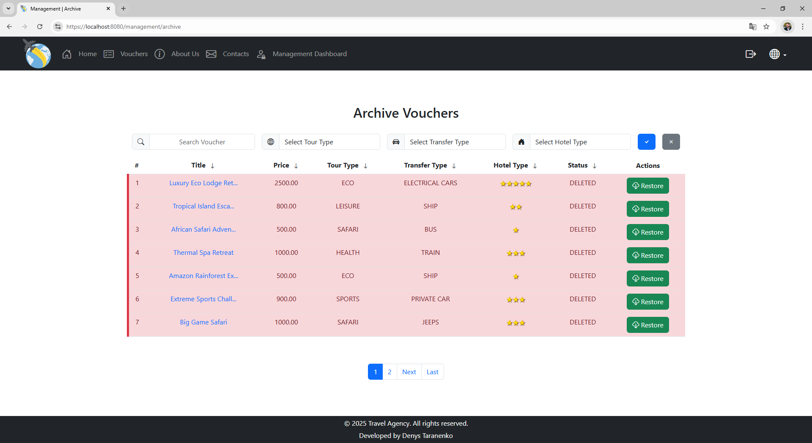
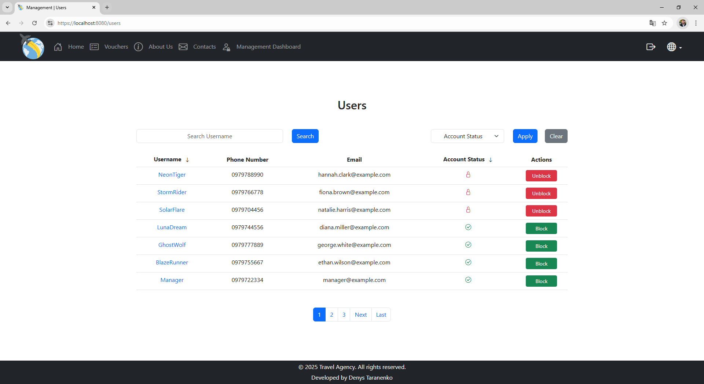

